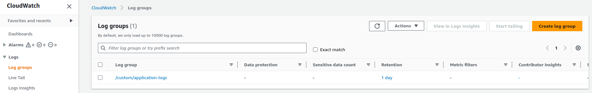
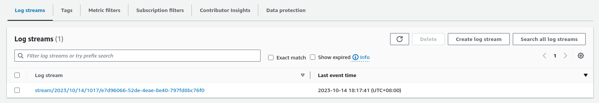

# Python Logging Part 2: AWS CloudWatch Logs Handler

---

Incorporating AWS CloudWatch Logs into Python applications via a custom logging handler is a practical approach for robust log management and monitoring. This article will walk you through the straightforward process of setting up and integrating CloudWatch Logs, providing a clear path for developers to enhance their application's log tracking and analysis capabilities.

<!-- more -->

??? note "Changelog"

    - 2023-10-27
        - minor formatting
    - 2023-10-15
        - minor formatting
    - 2023-10-14
        - initially published

---

## Prerequisites

Before proceeding with the next sections, you must ensure that you have:

1. An active [AWS Account](https://portal.aws.amazon.com/billing/signup#/start/email)
2. A working installation of [AWS CLI v2](https://docs.aws.amazon.com/cli/latest/userguide/getting-started-install.html)
3. Configured AWS credentials ([see instructions](https://docs.aws.amazon.com/cli/latest/userguide/cli-authentication-user.html#cli-authentication-user-configure-wizard))

---

## Handler

To integrate AWS CloudWatch Logs in Python using [boto3](https://pypi.org/project/boto3/) and subclassing the `Handler` class of the standard logging module, you can create a custom CloudWatch Logs handler. Here's a step-by-step guide:

Step 1: Install the necessary libraries if you haven't already:

```shell
pip install boto3 boto3-stubs[logs]

```

Step 2: Create a custom CloudWatch Logs handler by subclassing the `logging.Handler` class. Override the `emit` method to send log messages to CloudWatch Logs:

!!! tip
    The snippet below is annotated to explain blocks of code inline.

```python title="aws_cloudwatch_logs_handler.py" linenums="1"
import datetime
import logging
import time
import typing
import uuid

import boto3
from mypy_boto3_logs import client, type_defs

LogGroupRetentionDaysType = typing.Optional[
    typing.Literal[
        1, 3, 5, 7, 14, 30, 60, 90, 120, 150,
        180, 365, 400, 545, 731, 1096, 1827,
        2192, 2557, 2922, 3288, 3653,
    ]
]
"""
See: [PutRetentionPolicy](https://tinyurl.com/5fsu3brf)
"""


class CloudWatchLogsHandler(logging.Handler):
    """
    A custom logging handler based on [cloudwatch](https://pypi.org/project/cloudwatch/)
    by [labrixdigital](https://github.com/labrixdigital)
    """

    def __init__(
        self,
        log_group: str = None,
        *,
        log_stream: typing.Optional[str] = None,
        ttl: LogGroupRetentionDaysType = None,
        access_key: typing.Optional[str] = None,
        secret_key: typing.Optional[str] = None,
        region: typing.Optional[str] = None,
        profile: typing.Optional[str] = None,
    ) -> None:
        self.__log_group = self.__resolve_log_group(log_group)
        self.__log_stream = self.__resolve_log_stream(log_stream)
        self.__client = self.__resolve_client(profile, access_key, secret_key, region)
        self.__next_sequence_token: typing.Optional[str] = None
        self.__resolve_resources(ttl)

        logging.Handler.__init__(self)

    def __resolve_log_group(self, log_group: str) -> str:
        if log_group is None:
            raise ValueError("Log Group name is required.")

        return log_group

    def __resolve_log_stream(self, log_stream: str) -> str:
        if log_stream is None: 
            return "stream/{}/{}".format(
                datetime.datetime.strftime(datetime.datetime.utcnow(), "%Y/%m/%d/%H%M"),
                str(uuid.uuid4()),
            )

        return log_stream

    def __resolve_client(
        self,
        profile: typing.Optional[str],
        access_key: typing.Optional[str],
        secret_key: typing.Optional[str],
        region: typing.Optional[str],
    ) -> client.CloudWatchLogsClient:
        if profile is not None: # (1)!
            session = boto3.Session(profile_name=profile)
            return typing.cast(client.CloudWatchLogsClient, session.client("logs"))

        if (access_key is None) and (secret_key is None) and (region is None): # (2)!
            return typing.cast(client.CloudWatchLogsClient, boto3.client("logs"))

        elif access_key is None: # (3)!
            return typing.cast(
                client.CloudWatchLogsClient, boto3.client("logs", region_name=region)
            )

        else: # (4)!
            session = boto3.Session(
                aws_access_key_id=access_key,
                aws_secret_access_key=secret_key,
                region_name=region,
            )
            return typing.cast(client.CloudWatchLogsClient, session.client("logs"))

    def __resolve_resources(self, ttl: LogGroupRetentionDaysType) -> None:
        try: # (5)!
            response: type_defs.DescribeLogStreamsResponseTypeDef = (
                self.__client.describe_log_streams(logGroupName=self.__log_group)
            )
            for each_log_stream in response["logStreams"]:
                if each_log_stream["logStreamName"] == self.__log_stream:
                    self.__next_sequence_token = (
                        each_log_stream["uploadSequenceToken"]
                        if "uploadSequenceToken" in each_log_stream
                        else None
                    )

            if self.__next_sequence_token == None: # (6)!
                self.__client.create_log_stream(
                    logGroupName=self.__log_group, logStreamName=self.__log_stream
                )

        except self.__client.exceptions.ResourceNotFoundException: # (7)!
            self.__client.create_log_group(logGroupName=self.__log_group)
            self.__client.create_log_stream(
                logGroupName=self.__log_group, logStreamName=self.__log_stream
            )
            if ttl is not None:
                self.__client.put_retention_policy(
                    logGroupName=self.__log_group, retentionInDays=ttl
                )

        except self.__client.exceptions.ResourceAlreadyExistsException: # (8)!
            pass

    def send_log(self, timestamp: int, message: str) -> None:
        log_event = type_defs.InputLogEventTypeDef(timestamp=timestamp, message=message)

        if self.__next_sequence_token is not None:
            response = self.__client.put_log_events(
                logGroupName=self.__log_group,
                logStreamName=self.__log_stream,
                sequenceToken=self.__next_sequence_token,
                logEvents=[log_event],
            )
        else:
            response = self.__client.put_log_events(
                logGroupName=self.__log_group,
                logStreamName=self.__log_stream,
                logEvents=[log_event],
            )

        self.__next_sequence_token = response["nextSequenceToken"] # (9)!

    def emit(self, record: logging.LogRecord) -> None:
        """
        This is the overriden function from the handler to send logs to AWS
        """

        timestamp = round(time.time() * 1000) # (10)!
        message = self.format(record) # (11)!

        try:
            self.send_log(timestamp, message)

        except self.__client.exceptions.DataAlreadyAcceptedException as e: # (12)!
            e_str = str(e)
            self.__next_sequence_token = e_str[e_str.find("sequenceToken: ") + 15 :]

        except self.__client.exceptions.InvalidSequenceTokenException as e: # (13)!
            e_str = str(e)
            self.__next_sequence_token = e_str[e_str.find("sequenceToken is: ") + 18 :]
            self.send_log(timestamp, message)

        except self.__client.exceptions.ClientError as e: # (14)!
            time.sleep(3)
            self.send_log(timestamp, message)

```

1. Return `client` based on provided profile.
2. Return `client` based on AWS credentials set in config file.
3. Return `client` based on AWS credentials set in config file and custom region.
4. Return `client` based on manually entered AWS credentials.
5. Find the sequence token in the log streams.
6. If no sequence token is found, then create the stream.
7. On `ResourceNotFoundException`, create the log group.
8. On `ResourceAlreadyExistsException`, ignore.
9. Store the next sequence token.
10. Get the current Unix time in milliseconds (required by AWS).
11. Format the message using the configured `Formatter`.
12. Ignore `DataAlreadyAcceptedException` and get next sequence token.
13. If the current sequence token is invalid, change the sequence token and retry.
14. Wait and try resending.

---

## Usage

After creating our custom `Handler`, we can use it the same way we use [other built-in logging handlers](/blog/python-logging-part-1-handlers-and-formatters/) in Python's logging module:

```python title="app.py" linenums="1"
import logging
import time
import typing

from aws_cloudwatch_logs_handler import CloudWatchLogsHandler

LOGGER_NAME: typing.Final[str] = "LoggerName"

logger = logging.getLogger(LOGGER_NAME)

logger.setLevel(logging.DEBUG)

formatter = logging.Formatter(
    (
        "%(asctime)s.%(msecs)03d" + time.strftime("%z") + " "
        "| %(process)-8d "
        "| %(thread)-16d "
        "| %(levelname)-8s "
        "| %(lineno)-4d "
        "| %(message)s"
    ),
    "%Y-%m-%dT%H:%M:%S",
)

handler = CloudWatchLogsHandler("/custom/application-logs", ttl=1)

handler.setLevel(logging.DEBUG)
handler.setFormatter(formatter)

logger.addHandler(handler)

# Sample
logger.debug("Debug message.")
logger.info("Info message.")
logger.warning("Warning message.")
logger.error("Error message.")
logger.critical("Warning message.")
logger.exception("Exception message.")

```

After running our custom handler:

```shell
python app.py
```

We can now check CloudWatch Logs in our AWS console and we should see our sample log messages:

<figure markdown>
  { loading=lazy }
  <figcaption>Figure 1: Log Group <code>/custom/application-logs</code></figcaption>
</figure>

<figure markdown>
  { loading=lazy }
  <figcaption>Figure 2: Log Stream <code>stream/YYYY/MM/DD/hhmm/UUID4</code></figcaption>
</figure>

<figure markdown>
  { loading=lazy }
  <figcaption>Figure 3: Log Events</figcaption>
</figure>

---

## Use Cases

The implementation of CloudWatch Logs in Python using boto3 and a custom CloudWatch Logs handler can be used in various scenarios and use cases. Here's a list of possible use cases for this implementation:

1. **Application Logging**: Centralized logging for your Python applications to monitor their behavior, troubleshoot issues, and track application performance.
2. **Distributed Systems**: In distributed systems, you can aggregate logs from different components and services into a single CloudWatch Logs log group for centralized monitoring.
3. **Error Tracking**: Use CloudWatch Logs to capture and track application errors, exceptions, and stack traces, making it easier to identify and resolve issues.
4. **Security and Compliance**: Store security-related logs and audit trails in CloudWatch Logs to help meet compliance requirements and monitor suspicious activities.
5. **Application Performance Monitoring (APM)**: Correlate logs with performance data to gain insights into application performance and pinpoint bottlenecks.

---

## Conclusion

In conclusion, harnessing the power of AWS CloudWatch Logs in Python by leveraging a custom CloudWatch Logs Handler subclass of Python's logging module offers developers a robust and flexible solution for centralized log management. This implementation empowers Python applications to seamlessly transmit log data to CloudWatch Logs, allowing for real-time monitoring, comprehensive troubleshooting, and a wealth of potential use cases. Whether tracking application performance, debugging issues, or ensuring compliance and security, the integration of CloudWatch Logs through a custom handler equips developers with the essential tools to take control of their log data and optimize their AWS environment.

---
